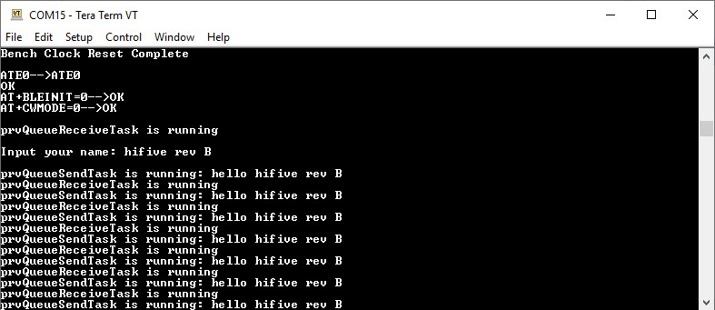

# hifive1-revb-freertos-uart

## SiFive HiFive1 Rev B - FreeRTOS
Example for using uart_printf, uart_gets on FreeRTOS

The project aims to implement printf, vprintf, sprintf, vsprintf functions which are used on FreeRTOS to print log to terminal with safe way

## Materials:
- SiFive HiFive 1 Rev B1 board
- [SiFive Freedom Studio](https://www.sifive.com/boards)
- Source code downloaded from https://github.com/TaLucGiaHoang/hifive1-revb-freertos-uart

## References:
The project was modified base on examples code of FreeRTOS demo for HiFive1 Rev B board.

Refer to FreeRTOS/Demo/RISC-V_RV32_SiFive_HiFive1_FreedomStudio on https://sourceforge.net/p/freertos/code/HEAD/tree/trunk/ (r2752)

## Usage

